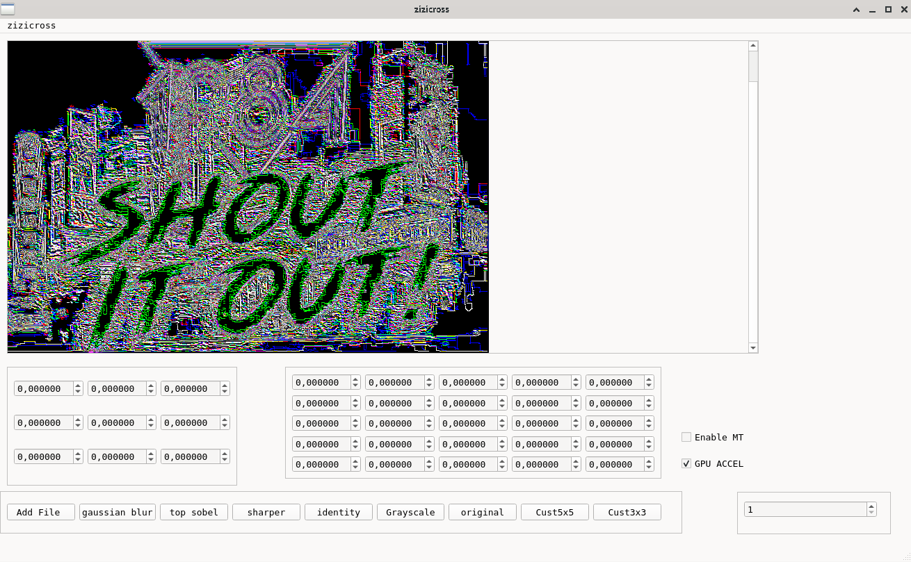

# ZiZiCross (aka ZZX)

This a test convolution tool for a special project involving, since the tool is 
for a purpose that is internal and private, it's just fine to open source the main app.
However the `secret` algorithms will not be published here anytime soon or never.

# What it looks like? 



## Build
1. Native build - made with Qt `qmake` , possible rework for `CMake` but I don't like it :/
2. GPGPU accelerated
3. The software requires `opencl` however you can build it without one in `.pro` file
just add 
```
CONFIG -= GPUACCEL
```

- need OpenCL for this to work
- Current project is made for AMD/Linux (debian/ubuntu) with the approprate drivers (see below).

### Prrequsites

For `OpenCL` acceleration install `OpenCL` sdk and tools and drivers for your host
[for example this link](//https://support.zivid.com/en/latest/getting-started/software-installation/gpu/install-opencl-drivers-ubuntu.html)

---

Add links inline like [this link to the Qt homepage](https://www.qt.io),
or with a reference like [this other link to the Qt homepage][1].


### Known issues

1. The images in `infolist` folder shows gaussian blur with software and 
opencl acceleration. Apparently the gpu enhancement is SLOWER and performs
like multiple kernel convolving.
2. The OpenCL looks like it performs like 5-6 times the convolving for unknown
reason. To be investigated.
3. UI needs a dynamic resize of the layout.
4. The image widget (the one you see the pictures) does not support Zoom+/Zoom- maybe will do it...
Second Level Heading in Alternate Style
---------------------------------------

### Special thanks
To RTimarev (Rado) for providing a great image of the fancy bird for testing the huge images.

---


Made with [Qt](https://www.qt.io) and [OpenCL](https://www.khronos.org/opencl/)
